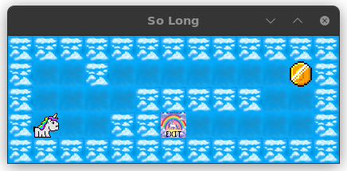
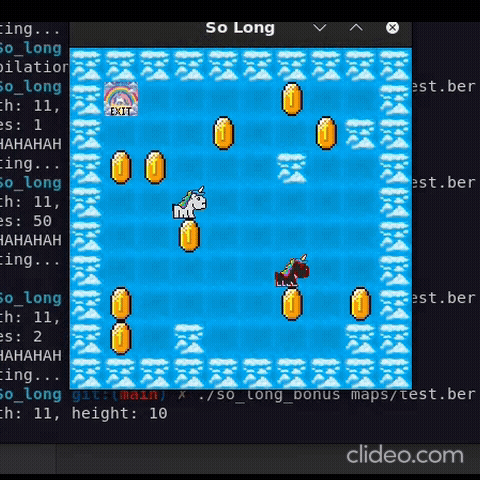

# so_long

so_long is a 2D game developed as part of the École 42 curriculum. The project aims to introduce students to basic game development concepts using the MiniLibX (MLX42) library from Codam.

## Project Overview
The goal of the game is to guide the player through a map, collect all the collectible items (`C`), and reach the exit (`E`). The project has two modes:
- **Base Game**: A simple map without enemies.
- **Bonus Game**: Includes an enemy (a unicorn) with enhanced behavior.

## Game Features
### Map Elements:
The game map is represented by `.ber` files, consisting of the following characters:
- `0`: Walkable path.
- `1`: Wall.
- `C`: Collectible items.
- `E`: Exit.
- `P`: Player start position.

### Game Modes:
1. **Base Mode**: Compile with `make` to create the base game executable `so_long`.
   - No enemies present.
   - 
2. **Bonus Mode**: Compile with `make bonus` to create the bonus game executable `so_long_bonus`.
   - Introduces a unicorn enemy (`X`) that accelerates when the player enters its field of vision, implemented with a simplified DDA algorithm.
   - 

### Gameplay:
- **Controls**: Use `W`, `A`, `S`, `D` keys to move the player.
- The player must collect all `C` items before the exit `E` becomes accessible.
- The map must not exceed 150x150 tiles due to MLX limitations and flood fill algorithm constraints.

### Bonus Features:
- **Enemy Behavior**: The unicorn enemy moves based on a simplified DDA algorithm and accelerates when it sees the player.
- **Enhanced Rendering**: Additional visual elements, such as collectible counters and animations.

## Compilation and Execution
### Dependencies:
Ensure you have the required dependencies installed for MiniLibX (MLX42) and GLFW.

### Compilation:
- To launch the base game, use: `./so_long maps/rectangle.ber`
- To launch the bonus game, use: `./so_long_bonus maps/enemy.ber`
- Run `make` to compile the base game.
- Run `make bonus` to compile the bonus game with enemies.

### Cleaning:
- Use `make clean` to remove object files.
- Use `make fclean` to remove object files and executables.
- Use `make re` to clean and recompile the project.

## Map Guidelines
- For automatic map generation, check out my map generator tool: [So_long_map_generator](https://github.com/rom98759/So_long_map_generator).
- Maps must be rectangular, enclosed by walls, and follow the character rules described above.
- Maps larger than 150x150 tiles are not supported due to rendering constraints.
- Invalid maps will result in an error message.

## Makefile Structure
- **`make`**: Compiles the base game.
- **`make bonus`**: Compiles the bonus game.
- **`make clean`**: Removes object files.
- **`make fclean`**: Removes object files and executables.
- **`make re`**: Cleans and recompiles the project.

## License
This project is developed as part of the École 42 curriculum and is for educational purposes only.

